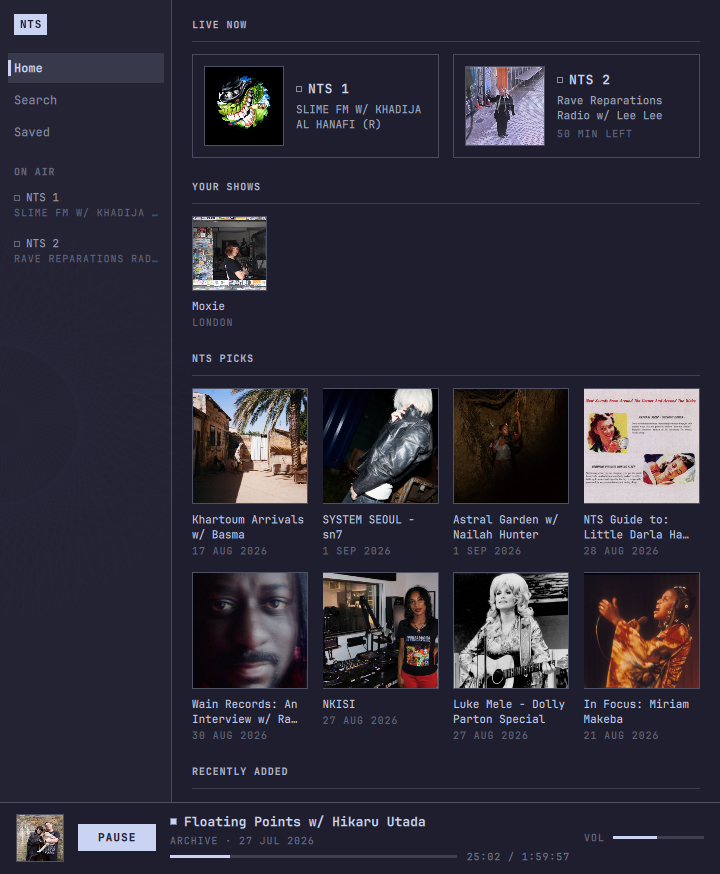
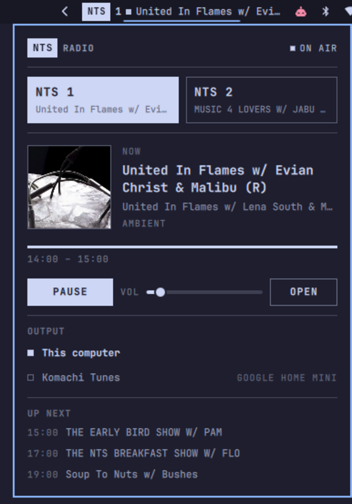

# NTS Radio for Omarchy

A [NTS Radio](https://www.nts.live) client for Omarchy: live NTS 1 and NTS 2 in
the top bar, and a full browser window for the archive.



Two surfaces, one player.

**In the bar** — the station mark, which channel you are on, and whether audio
is flowing. Click it for the panel: channel selector, the current broadcast with
artwork, transport, output, and what is coming up next.



**The browser window** — search NTS by show, host, track or tag; browse any
show's back catalogue; open an episode for its description and tracklist; and
keep a library of saved shows and episodes. Archived episodes play through the
same player as live radio, so moving between them is one click and closing the
window never interrupts anything.

Audio plays locally through **mpv** and PipeWire, or on a Chromecast device that
fetches the live stream itself. There is no embedded browser and no background
daemon — mpv runs only while something is playing, and it exposes MPRIS, so
media keys and any other desktop media client control it like any other player.

## Requirements

| Dependency | Required | What it does |
|------------|----------|--------------|
| `mpv` | for playback | plays live streams and archived episodes on this machine |
| `curl` | yes | fetches the schedule and everything in the browser (already present on Omarchy) |
| `yt-dlp` | for the archive | resolves archived episodes, which NTS hosts on SoundCloud / Mixcloud |
| `mpv-mpris` | optional | media-key and MPRIS control |
| `python-pychromecast` | optional | casting live radio to Chromecast / Google Home / Nest devices |

On Arch / Omarchy:

```bash
sudo pacman -S --needed mpv yt-dlp mpv-mpris python-pychromecast
```

Every one of those is in the official repos; nothing here needs the AUR. Each
optional piece degrades quietly on its own: without `mpv-mpris` you lose media
keys, without `python-pychromecast` the panel simply does not offer casting,
without `yt-dlp` live radio still works and only the archive goes quiet, and
without `mpv` the panel says so and points at the install command instead of
failing with a stream error.

Why `yt-dlp` is needed for the archive is explained under
[Archived shows](#archived-shows) — briefly, NTS does not host its own episode
audio.

Without `mpv-mpris` everything still works; you just lose media-key control.
The plugin looks for the script at `/etc/mpv/scripts/mpris.so`,
`/usr/lib/mpv/mpris.so`, `/usr/local/lib/mpv/mpris.so`,
`/usr/lib/x86_64-linux-gnu/mpv/mpris.so`, `~/.config/mpv/scripts/mpris.so` and
`~/.local/share/mpv/scripts/mpris.so`. `omarchy-shell nts-radio status` reports
`"mpris": true` when it found one.

## Install

```bash
omarchy plugin add https://github.com/sjfortin/omarchy-nts-radio.git --enable --yes
```

Or by hand:

```bash
git clone https://github.com/sjfortin/omarchy-nts-radio.git \
  ~/.config/omarchy/plugins/sjfortin.nts-radio
omarchy-shell shell rescanPlugins
omarchy plugin enable sjfortin.nts-radio
```

The widget lands on the right of the bar. Move it with `omarchy bar move`:

```bash
omarchy bar move sjfortin.nts-radio --section right --after omarchy.tray
```

## Using it

### In the bar

| Action | Result |
|--------|--------|
| Click | open / close the panel |
| Middle-click | play / pause |
| Right-click | switch NTS 1 / NTS 2 — or, from an archived show, back to live |
| Scroll | volume up / down |

The bar always shows what is actually playing. On live radio that is the channel
number and the broadcast title; on an archived show the channel is replaced by
`ARC` and the title is the episode, so the widget never claims to be playing
NTS 2 while a two-year-old show is coming out of the speakers.

### In the panel

Click either channel block to switch — the selected one is inverted, and each
block shows what is on that channel right now so you can choose without
switching first. `PLAY` / `PAUSE` starts and stops, `VOL` sets the stream's own
volume (independent of your system volume).

The bottom row is `BROWSE` (open the browser window), `LIVE` (only while an
archived show is playing — one press back to live radio) and `OPEN` (the current
show on nts.live).

While an archived show is playing the panel shows its artwork, its broadcast
date, and how far through it you are, instead of the live schedule.

Playback is not tied to the panel. Closing the panel, moving the widget, or
opening a different bar panel all leave audio running.

### The browser window

Open it from `BROWSE` in the panel, or:

```bash
omarchy-shell nts-radio browser
```

Three destinations in the left rail, plus both live channels always one click
away:

- **Home** — what is on air now, what you were part way through, your saved
  shows, and NTS's own editorial rails (NTS Picks, Recently added).
- **Search** — grouped results across shows, episodes, tracks and tags.
- **Saved** — your library, in two tabs: shows and episodes.

Clicking a row opens it; clicking its artwork plays it. Those are deliberately
different targets — browsing and listening are different intentions.

**Keyboard**

| Key | Action |
|-----|--------|
| `/` or `Ctrl-F` | jump to search |
| `↑` `↓` or `k` `j` | move the cursor through results |
| `PgUp` `PgDn` | move the cursor five at a time |
| `Enter` | open what the cursor is on |
| `p` | play what the cursor is on |
| `b` | save / unsave what the cursor is on |
| `Tab` | switch tabs (on Saved) |
| `Space` | play / pause whatever is on air |
| `1` `2` | back to live NTS 1 / NTS 2 |
| `h` `s` | Home / Saved |
| `←` `→` | scrub an archived show by 30s |
| `Esc` | back, then close |
| `Ctrl-W` | close |

In search, `↓` moves out of the query field and into the results, and `↑` from
the first result puts you back in the field to refine it.

### Archived shows

Every show page lists its back catalogue; every episode page carries the
description, the broadcast date and — where NTS has one — the tracklist.

**Tracklist timestamps are seek targets.** While the episode is playing, click a
time to jump to that track. NTS fingerprints only part of most tracklists and
evenly spaces the rest, so a time shown with a leading `~` is NTS's estimate
rather than a heard position and may be out by a minute or so.

Where you got to in a part-heard episode is remembered, so it turns up under
*Continue listening* on Home and the episode page offers `RESUME` alongside
`FROM START`.

**Why `yt-dlp`.** NTS does not host archived audio. Every episode in their API
points at a SoundCloud or Mixcloud upload, which is what their own website plays
too. mpv's ytdl hook resolves those, so `yt-dlp` is what turns an episode page
into sound. Live radio does not use it at all.

NTS's own API has an endpoint that would hand back a direct audio URL, but only
against a token embedded in their website — their client credential, not
yours. Shipping someone else's API token inside a plugin is not something this
does, and `yt-dlp` reaches exactly the same public audio without borrowing one.

### Saved shows and episodes — and why there is no login

`SAVE` on any show or episode adds it to your library; the `Saved` page is that
library, and the browser reads it offline.

**The library is local.** It lives in
`~/.local/state/omarchy/nts-radio/library.json` — a plain JSON file you own, can
read, can edit, and can sync yourself if you want to.

It is not your NTS account, and that is a deliberate decision rather than an
omission. NTS authenticates through Firebase with an email-and-password
provider. There is no public developer API, no OAuth flow, no browser-based
authorization a third-party client can use, and nothing NTS documents for
integrations. The only way to implement "log in to NTS" here would be to put a
password field in this plugin, take your real NTS credentials, and replay them
against Google's identity endpoint using NTS's own embedded API key.

That is credential scraping with extra steps. It would ask you to trust a
third-party bar widget with an account password, it would break without warning
the moment NTS changed anything, and it would be handling secrets that a desktop
plugin has no business handling. So the plugin does not do it, and keeps a local
library instead. If NTS ever publishes a real integration surface, this is the
part that would change.

The practical differences: saves made here do not appear on nts.live or in the
NTS mobile app, and favourites you already have there do not appear here.

### Casting

The `OUTPUT` section of the panel lists *This computer* plus any
Chromecast-protocol device on your network — Chromecast, Chromecast Audio,
Google Home, Nest speakers and displays. Pick one and the audio moves; pick
*This computer* and it comes back. If something was playing, it keeps playing
across the move.

Casting is not "route this laptop's audio elsewhere". The device fetches the
NTS stream itself, so nothing is decoded or re-encoded here and **your laptop
can sleep without interrupting the radio**. The plugin keeps a control
connection only to start, stop, set volume, and report status.

**Casting is live radio only.** An archived episode has no URL a Chromecast
could fetch — it has to be resolved on this machine first — so archived shows
always play locally, whatever output is selected. The panel says so, and your
device choice is remembered and takes effect again the moment live radio is
back on.

Two more consequences worth knowing:

- The volume slider controls whichever output is active — the device's own
  volume when casting, mpv's when local. They are separate levels.
- Media keys and MPRIS apply to local playback only. A cast session is running
  on the device, not on this machine, so there is no local player for them to
  talk to.

The device shows the programme that was on air when casting started. Refreshing
that would mean reloading the stream on the device, and a gap in the audio
every time a show changes is worse than a stale title.

Your chosen device is remembered between sessions and reconnected
automatically when it is back on the network.

Because the device is doing the playing, a cast survives this shell. If
Omarchy restarts — a crash, `omarchy restart shell`, a plugin reload — while
you are casting, the radio keeps going, and the plugin reconnects and picks
the session back up so the panel shows it playing and can stop it. It only
adopts a session that is playing an NTS stream it recognizes, so it will never
take over someone else's music on the same speaker.

### Media keys

While something is playing, mpv registers as
`org.mpris.MediaPlayer2.mpv.ntsradio`. Play/pause keys work, and the track
title reported to your OSD is the current NTS show or archived episode rather
than the raw stream name. On live radio, resuming rejoins the live edge instead
of replaying whatever was left in the buffer; on an archived show it carries on
from where you paused.

### From the command line / keybindings

```bash
omarchy-shell nts-radio toggle       # play or pause
omarchy-shell nts-radio play
omarchy-shell nts-radio pause
omarchy-shell nts-radio next         # other channel
omarchy-shell nts-radio channel 2
omarchy-shell nts-radio volume 60
omarchy-shell nts-radio status       # JSON: mode, playback, output, show, archive, library
omarchy-shell nts-radio devices      # discover cast devices, as JSON
omarchy-shell nts-radio output local            # play here
omarchy-shell nts-radio output cast             # play on the remembered device
omarchy-shell nts-radio output <device-uuid>    # play on a specific device

omarchy-shell nts-radio browser      # open / close the browser window
omarchy-shell nts-radio live         # back to live radio
omarchy-shell nts-radio live 2       # back to live, on NTS 2
omarchy-shell nts-radio episode <show-alias> <episode-alias>   # play an archived show
omarchy-shell nts-radio seek 1500    # jump to 25:00 in an archived show
omarchy-shell nts-radio seek +30     # forward 30s
omarchy-shell nts-radio seek -30     # back 30s
```

The two aliases an `episode` takes are the last two path segments of its
nts.live URL — for
`https://www.nts.live/shows/floating-points/episodes/floating-points-27th-july-2026`
that is `floating-points floating-points-27th-july-2026`.

Bind them in `~/.config/hypr/bindings.conf`:

```
bindd = SUPER SHIFT, N, NTS play/pause, exec, omarchy-shell nts-radio toggle
bindd = SUPER SHIFT, M, NTS channel,    exec, omarchy-shell nts-radio next
bindd = SUPER SHIFT, B, NTS browser,    exec, omarchy-shell nts-radio browser
```

The browser can also be opened straight onto a page:

```bash
omarchy-shell shell summon sjfortin.nts-radio '{"page":"search"}'
```

## Settings

Under **Setup → Plugins → NTS Radio**, or as keys on the widget's entry in
`~/.config/omarchy/shell.json`:

| Key | Default | Meaning |
|-----|---------|---------|
| `channel` | `NTS 1` | Channel to start on. Switching in the panel updates this, so the plugin comes back on the channel you left it on. |
| `showTitleInBar` | `When playing` | `Always`, `When playing`, or `Never` for the title in the bar. |
| `maxBarTextWidth` | `160` | Pixel cap on that title. `0` hides it. |
| `volume` | `70` | Stream volume, remembered between sessions. |
| `refreshMinutes` | `1` | Minutes between schedule refreshes while a panel or the browser is open, or audio is playing. |
| `output` | `local` | `local` or `cast`. Set by picking an output in the panel. |
| `castDevice` | — | UUID of the remembered cast device. |
| `castDeviceName` | — | Its friendly name, so the panel can name it before discovery finishes. |

Editing these takes effect immediately — no restart.

## How it behaves

**Network.** The live schedule is one `curl` to
`https://www.nts.live/api/v2/live` per refresh, capped at 12 seconds and run in
a subprocess, so the shell's UI thread never waits on the network. While a panel
or the browser is open, or audio is playing, that is once per `refreshMinutes`;
otherwise once every 15 minutes. A refresh is also scheduled to land just after
the current broadcast ends, so the panel changes over with the schedule instead
of drifting up to a minute behind.

Everything in the browser goes through one small client with at most three
requests in flight, a 15-second timeout on each, a single retry for transport
failures, and a five-minute in-memory cache — so revisiting a show or retyping a
search costs nothing, and nothing is fetched for a window that is not open.

**Failures.** A failed fetch keeps the last good schedule on screen and shows a
single quiet line — never a notification, never a dialog. Pages that cannot load
say so inline with a *Try again*. A dropped live stream reconnects on a
5s / 15s / 45s / 60s backoff; an archived show that fails resumes from where it
stopped rather than the top. Nothing here can take the shell down: every
response is parsed defensively, every string is stripped of markup and
length-capped before it reaches the UI, artwork is only loaded from NTS's own
media hosts, and the only URL ever handed to mpv is checked against an allowlist
of SoundCloud and Mixcloud first.

Offline, the browser still opens, live-schedule data stays on screen, and your
saved library reads normally, because it is a local file.

**Resources.** mpv exists only while playing, and is stopped five minutes after
you pause — an archived show remembers its position first, so pressing play
picks it up where you left it. The cast bridge is a Python process that runs
only while the panel is open or a cast is in progress. Closing the browser
window destroys every page in it; playback is unaffected, because the player
belongs to the plugin's service and not to any window. Disabling or removing the
plugin stops everything immediately and removes mpv's IPC socket.

## Architecture

```
manifest.json      plugin manifest — service + bar-widget + overlay
Service.qml        the shared brain: schedule, playback mode, library, IPC
Player.qml         the mpv child process and its JSON IPC socket
Caster.qml         playback on a Chromecast device, and device discovery
Api.qml            the API client: queue, concurrency, retries, cache
Fetcher.qml        one HTTP GET, in a subprocess
Model.js           live schedule endpoints, parsing and sanitization
NtsApi.js          archive endpoints: search, shows, episodes, tracklists
Library.js         the local library: saved shows, episodes, resume positions
scripts/cast.py    the Chromecast bridge, newline JSON on stdin/stdout
BarWidget.qml      the collapsed bar presence, and host for the panel popup
Panel.qml          the bar panel — the mini-player
Browser.qml        the browser window: routing, keyboard, layout
NtsMark.qml        the station mark
pages/             HomePage, SearchPage, SavedPage, ShowPage, EpisodePage
components/        the shared kit — cards, rows, tracklist, transport, rail
```

**One service owns playback.** `Service.qml` is created once by the shell and
lives for as long as the plugin is enabled. The bar widget resolves it, and the
shell hands the very same object to the browser window as `service`. Neither
surface owns the player; both are views onto it. That is the whole reason
opening or closing the browser, switching workspaces, or moving the widget
cannot interrupt audio — mpv is parented to the service, not to anything on
screen.

`Player.qml` handles both media, and keeps them strictly apart: a live stream
has no end, no position and no seek, and resuming it means rejoining the live
edge, while an archived show is an ordinary finite recording that pauses, seeks
and finishes. Mixing those two up is the single easiest way to make a radio
player feel broken, so the mode is explicit and the reconnect logic only applies
to live.

**One client owns the network.** Pages never fetch. They ask `Api.qml` for a
parsed result and get a callback; queueing, concurrency, timeouts, retries and
caching all live in one place, and every endpoint URL is built by `NtsApi.js`.

**The `.js` files are pure.** `Model.js`, `NtsApi.js` and `Library.js` hold no
QML types, do no IO and have no side effects — every NTS URL, every response
shape and every piece of sanitization is in them. If NTS changes their service,
those are the files to change.

### NTS API limitations found while building this

- **There is no public API.** Everything here was worked out from the endpoints
  the nts.live player itself calls. They are unversioned and undocumented and
  can change without notice.
- **`/search` requires `version=2`.** Without it the endpoint returns HTTP 200
  with a permanently empty `results[]`, which is indistinguishable from "no
  matches".
- **Episode audio is not NTS-hosted**, so archived playback depends on `yt-dlp`
  and on the SoundCloud/Mixcloud upload still existing. Some broadcasts were
  never uploaded; those episodes are listed with *No audio*.
- **Tracklist timestamps are partly estimated** — see above.
- **There is no host resource.** NTS models a host as a show: the site's own
  host links point at `/shows/{alias}`, which carries the presenter's image,
  biography and back catalogue. There is one show page here rather than two
  pages showing the same thing.
- **There is no addressable "series".** Saved content therefore has two tabs,
  shows and episodes, rather than three.
- **Authentication is Firebase email/password with no third-party flow** — see
  [above](#saved-shows-and-episodes--and-why-there-is-no-login).
- **Tags are not destinations.** Search returns them, but NTS has no tag page
  this plugin can open, so selecting a tag runs it as a search.

## Removal

```bash
omarchy plugin remove sjfortin.nts-radio
```

Or, for a manual install:

```bash
omarchy plugin disable sjfortin.nts-radio
rm -rf ~/.config/omarchy/plugins/sjfortin.nts-radio
omarchy-shell shell rescanPlugins
```

Disabling stops playback and leaves nothing running. Outside its entry in
`~/.config/omarchy/shell.json`, which `omarchy plugin disable` removes for you,
the only thing the plugin writes is your library at
`~/.local/state/omarchy/nts-radio/library.json`. That is left alone on removal,
so reinstalling gets your saved shows back; delete it yourself if you want it
gone.

## Troubleshooting

**Nothing plays and the panel says "Stream unavailable".** Check that mpv is
installed and can reach the stream:

```bash
mpv --no-video https://stream-relay-geo.ntslive.net/stream
```

**An archived show will not play.** Live radio does not need `yt-dlp` but the
archive does — `omarchy-shell nts-radio status` reports
`"ytdlAvailable": false` when it is missing. If it is installed and a specific
episode still fails, check whether the upload is still there:

```bash
yt-dlp -f bestaudio --get-url "$(omarchy-shell nts-radio status | jq -r .archive.url)"
```

An episode listed as *No audio* was never uploaded by NTS; there is nothing to
play.

**Search returns nothing for everything.** That is the `version=2` symptom
described above, and would mean NTS changed the endpoint. `NtsApi.js` is the
file to look at.

**No devices appear under Output.** Confirm the backend is present with
`omarchy-shell nts-radio status` — `"castAvailable": true` means the bridge
loaded. Then `omarchy-shell nts-radio devices` runs a discovery and prints what
it found. Devices must be on the same network segment as this machine; mDNS
does not cross most VLANs or guest networks.

**Media keys do nothing.** Install `mpv-mpris` and confirm
`omarchy-shell nts-radio status` reports `"mpris": true`. Media keys only reach
this plugin while it is actually playing; when it is stopped there is no player
to control, and the keys fall through to whatever else is running.

**The browser or panel looks stale after editing the plugin.** Saving a file
under `~/.config/omarchy/plugins/` reloads the plugin, but QML files loaded by
URL are cached for the life of the process. `omarchy restart shell` picks them
up.

**Playback state looks wrong.** `omarchy-shell nts-radio status` reports what
the plugin believes; comparing it with mpv directly usually settles it:

```bash
echo '{"command":["get_property","time-pos"]}' \
  | socat - "$XDG_RUNTIME_DIR/omarchy-nts-radio.mpv.sock"
```

**Your saved library looks wrong.** It is a plain file — read it, fix it, or
delete it:

```bash
cat ~/.local/state/omarchy/nts-radio/library.json
```

Anything malformed in it is dropped on load rather than breaking the browser.

## Notes

This is an unofficial, unaffiliated plugin. It is not endorsed by NTS Live, and
it ships none of their artwork or trademarks — the station mark is drawn from
your Omarchy theme's own two colours. It plays the same public streams and reads
the same public endpoints the nts.live website does, with no borrowed
credentials. Please support NTS at
[nts.live/supporters](https://www.nts.live/supporters).

## License

MIT. See [LICENSE](LICENSE).
